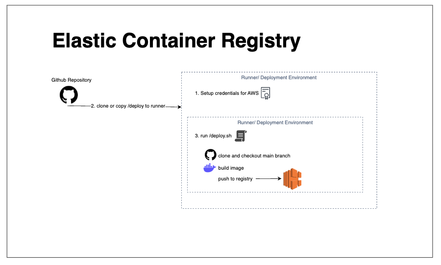

# Diagram

# 1. `deploy/push.sh`
## flags

- `--branch=<branch_to_checkout>` \
- `--ecr-url=<ecr_repo_url>` \
- `--tag=<image_tag>`

After running `deploy/push.sh` successfully, an image should be pushed to ECR. 

The output's final line will be something like: \
`image url: <IMAGE_URL>`

# Create a container and expose port to run the server:

`docker run -p 80:80 <IMAGE_URL>`

for local dev, try `curl localhost:80`